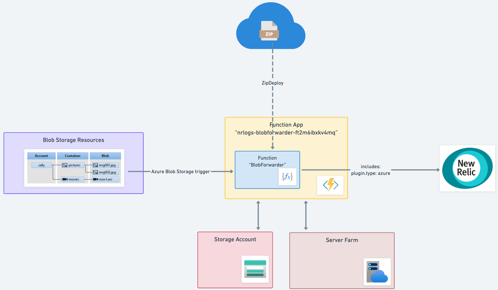

This function collects logs from Azure Blob Storage and forwards the contents to [New Relic Logs](https://docs.newrelic.com/docs/logs).

## How Does It Work?

This integration creates and configures the Azure resources necessary to efficiently forwards logs from an Azure Blob Storage to New Relic. 
It relies on Azure Blob Storage trigger, which will trigger an Azure Function to handle the log transport to New Relic.

## Installation

This integration requires both a New Relic and Azure account.

You can install this integration using one of two methods:
- **Automatic Installation** (recommended): Uses Azure ARM templates to automatically create and configure all resources
- **Manual Installation**: Step-by-step manual setup for users who want more control or have specific requirements

---

## Automatic Installation (Recommended)

The automatic installation uses Azure Resource Manager (ARM) templates to create and configure all necessary resources automatically.

### Option 1: Install through New Relic Marketplace

1. Visit the New Relic Marketplace \[[US](https://one.newrelic.com/marketplace)|[EU](https://one.newrelic.com/marketplace)\]
2. Search for "Microsoft Azure Blob Storage"
3. Click on the "Microsoft Azure Blob Storage" tile and follow the steps

### Option 2: Install Using Azure Portal

1. Retrieve your [New Relic License Key](https://docs.newrelic.com/docs/apis/intro-apis/new-relic-api-keys/#ingest-license-key)
2. Click the button below to start the installation process via the Azure Portal

[Deploy to Azure](https://portal.azure.com/#create/Microsoft.Template/uri/https%3A%2F%2Fraw.githubusercontent.com%2Fnewrelic%2Fnewrelic-azure-functions%2Fmaster%2FarmTemplates%2Fazuredeploy-blobforwarder.json)
using the [Azure ARM template](../armTemplates/azuredeploy-blobforwarder.json).

### ARM Template Parameters

Parameters that can be configured in your Azure Resource Manager Template

| Parameter  | Required | Default Value | Description
|---|---|---|---|
| New Relic License Key  | yes | `none` | Your New Relic [License key](https://docs.newrelic.com/docs/apis/intro-apis/new-relic-api-keys/). |
| Target Storage Account Name | yes | `none` | Name of the existing Azure Storage Account that contains the logs you want to forward. |
| Target Container Name | yes | `none` | Name of the container inside the target Storage Account that contains the log blobs. |
| Location | no | Resource group location | Region where the Function App and associated resources will be deployed. Defaults to the resource group's location. |
| New Relic Endpoint  |  no | `https://log-api.newrelic.com/log/v1` | New Relic Logs [ingestion endpoint](https://docs.newrelic.com/docs/logs/log-api/introduction-log-api/#endpoint). Use `https://log-api.eu.newrelic.com/log/v1` for EU accounts. |
| Max Retries To Resend Logs  | no | `3` | Number of times the function will attempt to resend data if there's a failure. |
| Retry Interval  | no | `2000` | Interval between retry attempts in milliseconds. |
| Disable Public Access To Storage Account | no | `false` | When set to `true`, disables public network access to the internal storage account used by the Function App. This creates a private network deployment with VNet integration, private endpoints, private DNS zones, and requires a Basic hosting plan or higher. When `false`, uses standard Consumption plan with public access. |

### Architecture

The ARM template supports two deployment architectures:

- **Standard deployment** (default): Function App with Consumption (serverless) plan and public network access
- **Private network deployment** (`disablePublicAccessToStorageAccount=true`): Function App with Basic plan (or higher), VNet integration, private endpoints, private DNS zones, and subnet configuration for enhanced security

---

## Manual Installation

Use this method if you want to manually create and configure the Function App yourself, or if you need more control over the setup process.

### Step 1: Create an Azure Function App

1. Log in to the Azure Portal and create a [new Function App](https://docs.microsoft.com/en-us/azure/azure-functions/functions-create-first-azure-function).

2. In the **Basics** tab, configure the following:

| Field | Value |
|---|---|
| Subscription | Your Azure subscription |
| Resource Group | Create new or select existing |
| Function App name | Globally unique name |
| Runtime stack | **Node.js** |
| Version | **22 LTS** |
| Region | Select your preferred region |
| Operating System | **Windows** |

3. Complete the **Storage** and **Networking** tabs as needed for your environment.

4. Click **Review + Create**, then **Create** to provision your Function App.

5. Wait 2-3 minutes for deployment to complete.

### Step 2: Deploy the Azure Function

Azure Functions v4 uses a package deployment model. Code cannot be edited directly in the Azure Portal. Instead, you must deploy a pre-built package and configure application settings.

#### Configure Application Settings

1. Navigate to your Function App → **Settings** → **Configuration**
2. Click the **Application settings** tab
3. Add the following settings by clicking **+ New application setting** for each:

#### Required Settings

| Name | Value                                                                                            | Description |
|------|--------------------------------------------------------------------------------------------------|-------------|
| `NR_LICENSE_KEY` | Your New Relic License Key                                                                       | Found at [one.newrelic.com](https://one.newrelic.com) → API Keys → License Key |
| `BLOB_FORWARDER_ENABLED` | `true`                                                                                           | Enables the Blob Storage trigger. **Must be lowercase** `true`. |
| `CONTAINER_NAME` | `your-container-name`                                                                            | Name of the container in the target storage account. Example: `logs` to monitor all blobs in the `logs` container. Do NOT include `/{name}` - the function adds this automatically. |
| `TargetAccountConnection` | Storage account connection string                                                                | Connection string from your target storage account (where logs are stored). Found in Storage Account → Security + networking → Access keys → Connection string. |
| `WEBSITE_RUN_FROM_PACKAGE` | `https://github.com/newrelic/newrelic-azure-functions/releases/latest/download/LogForwarder.zip` | URL to the deployment package. This tells Azure to download and run the latest function code from GitHub. |

**Getting the Target Storage Account Connection String:**

To get the `TargetAccountConnection` value, go to your target storage account → **Security + networking** → **Access keys** → Click **Show** next to "Connection string" and copy the value.

#### Optional Settings

| Name | Default Value | Description |
|------|---------------|-------------|
| `NR_ENDPOINT` | `https://log-api.newrelic.com/log/v1` | New Relic Logs API endpoint. Use `https://log-api.eu.newrelic.com/log/v1` for EU region accounts. |
| `NR_TAGS` | _(empty)_ | Custom attributes to add to all forwarded logs. Semicolon-delimited format: `env:prod;team:platform;app:myapp` |
| `NR_MAX_RETRIES` | `3` | Number of retry attempts if sending logs to New Relic fails. |
| `NR_RETRY_INTERVAL` | `2000` | Milliseconds to wait between retry attempts. |

#### Auto-Configured Settings (Verify Exist)

These settings are automatically created when you provision the Function App. Verify they exist and have the correct values:

| Name | Expected Value | Notes |
|------|----------------|-------|
| `FUNCTIONS_EXTENSION_VERSION` | `~4` | Azure Functions v4 runtime. |
| `FUNCTIONS_WORKER_RUNTIME` | `node` | Node.js worker runtime. May be auto-managed on some hosting plans. |
| `WEBSITE_NODE_DEFAULT_VERSION` | `~22` | Node.js version 22. May be auto-managed on some hosting plans. |
| `AzureWebJobsStorage` | _(connection string)_ | Internal storage account used by the Function App for state management. Auto-created. |

4. Click **Save** at the top of the page
5. Click **Continue** to confirm the Function App restart

#### Deploy the Function Package

1. Go to Function App → **Overview**
2. Click **Restart** to ensure all settings are applied and the package is downloaded
3. Wait 30-60 seconds for the deployment to complete

#### Verify Function Deployment

1. Navigate to **Functions** in the left menu
2. You should see **BlobForwarder** listed with Status: **Enabled**

3. Upload a log file to your blob storage container
4. Check New Relic Logs UI to verify logs are forwarded successfully
