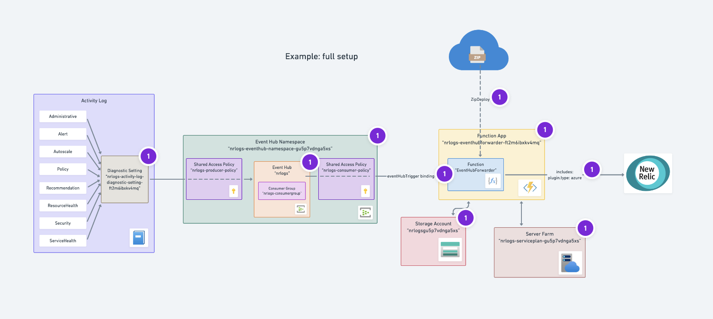
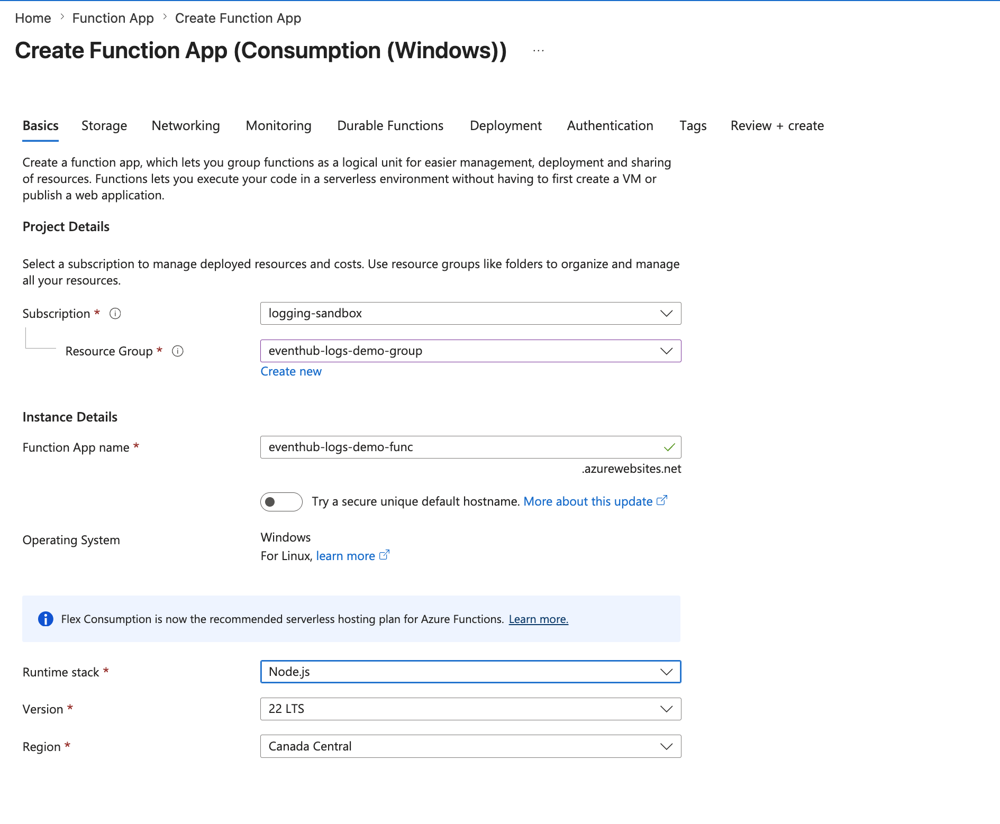
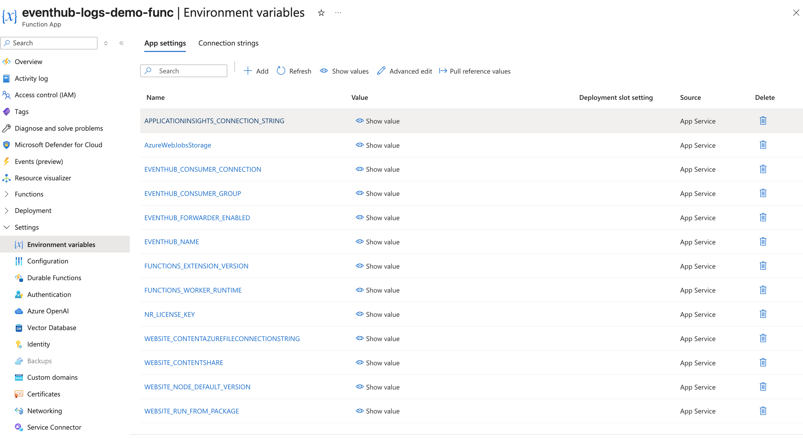
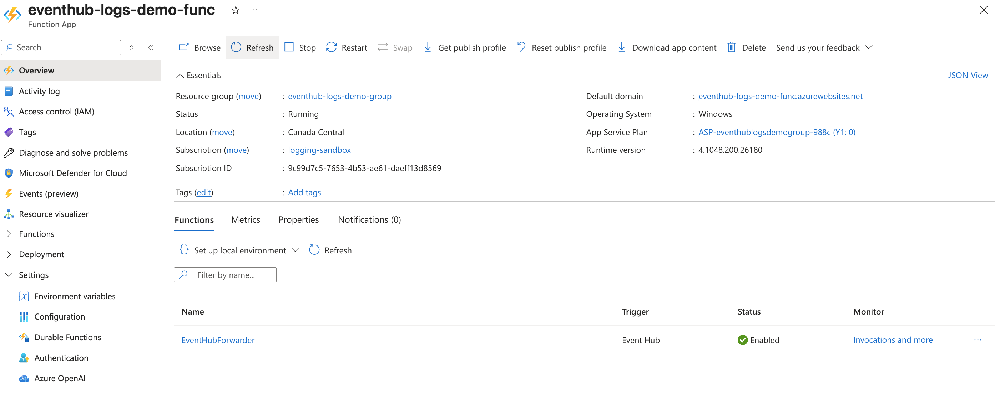

An Azure Resource Manager template to export Azure Platform logs to New Relic.

## How Does It Work?

This integration creates and configures the Azure resources necessary to efficiently forwards logs from an Azure Event Hub to New Relic. 
It relies on events managed by Azure Event Hub, Event Hub subsequently batches and triggers an Azure Function to handle the transport to New Relic.

Currently, this integration allows you to create resources to targets Azure Activity logs. If you have other log events that you would like to see shipped using Event hub trigger, [tell us about your use case](https://github.com/newrelic/newrelic-azure-functions/issues).

## Installation

This integration requires both a New Relic and Azure account.

You can install this integration using one of two methods:
- **Automatic Installation** (recommended): Uses Azure ARM templates to automatically create and configure all resources
- **Manual Installation**: Step-by-step manual setup for users who want more control or have specific requirements

---

## Automatic Installation (Recommended)

The automatic installation uses Azure Resource Manager (ARM) templates to create and configure all necessary resources automatically.

### Option 1: Install through New Relic Marketplace

1. Visit the New Relic Marketplace \[[US](https://one.newrelic.com/marketplace)|[EU](https://one.newrelic.com/marketplace)\]
2. Search for "Microsoft Azure Event Hub"
3. Click on the "Microsoft Azure Event Hub" tile and follow the steps

### Option 2: Install Using Azure Portal

1. Retrieve your [New Relic License Key](https://docs.newrelic.com/docs/apis/intro-apis/new-relic-api-keys/#ingest-license-key)
2. Click the button below to start the installation process via the Azure Portal

[Deploy to Azure](https://portal.azure.com/#create/Microsoft.Template/uri/https%3A%2F%2Fraw.githubusercontent.com%2Fnewrelic%2Fnewrelic-azure-functions%2Fmaster%2FarmTemplates%2Fazuredeploy-eventhubforwarder.json)
using the [Azure ARM template](../armTemplates/azuredeploy-eventhubforwarder.json).

### ARM Template Parameters

Parameters that can be configured in your Azure Resource Manager Template

| Parameter  | Required | Default Value | Description
|---|---|---|---|
| New Relic License Key  | yes | `none` | Your New Relic [License key](https://docs.newrelic.com/docs/apis/intro-apis/new-relic-api-keys/#license-key). |
| Location | no | Resource group location | Region where the Function App and associated resources will be deployed. Defaults to the resource group's location. |
| New Relic Endpoint  |  no | `https://log-api.newrelic.com/log/v1` | New Relic Logs [ingestion endpoint](https://docs.newrelic.com/docs/logs/log-api/introduction-log-api/#endpoint). Use `https://log-api.eu.newrelic.com/log/v1` for EU accounts. |
| Log Custom Attributes  | no | `none` | Attributes to be added to all logs forwarded to New Relic. Semicolon delimited (e.g. `env:prod;team:myTeam`) |
| Max Retries To Resend Logs  | no | `3` | Number of times the function will attempt to resend data if there's a failure. |
| Retry Interval  | no | `2000` | Interval between retry attempts in milliseconds. |
| Max Event Batch Size  | no | `500` | Maximum number of events delivered in a batch to the function. |
| Min Event Batch Size  | no | `20`  | Minimum number of events delivered in a batch to the function. |
| Max Wait Time         | no | `00:00:30` | Maximum time to wait to build up a batch before delivering to the function (format HH:MM:SS). |
| Event Hub Namespace Name | no | `none` | Namespace in which Event Hubs are allocated. Leave blank for a new namespace to be created automatically. |
| Event Hub Name | no | `none` | Name of the Event Hub where logs are allocated. Leave blank for a new Event Hub to be created automatically. |
| Scaling Mode | no | `Basic` | The scaling mode option configured for the New Relic Azure Log Forwarder. Setting this to `Enterprise` will configure autoscaling. **Note:** If you upgrade from Basic to Enterprise you will need to reprovision the EventHub due to Azure limits on partition count changes for Standard SKU. |
| Disable Public Access To Storage Account | no | `false` | When set to `true`, disables public network access to the internal storage account used by the Function App. This creates a private network deployment with VNet integration, private endpoints, private DNS zones, and requires a Basic hosting plan or higher. When `false`, uses standard Consumption plan with public access. |
| Enable Administrative Azure Activity Logs | no | `false` | Contains the record of all create, update, delete, and action operations performed through Resource Manager. More information about Administrative category in [azure official documentation](https://docs.microsoft.com/en-us/azure/azure-monitor/essentials/activity-log-schema#administrative-category). |
| Enable Alert Azure Activity Logs | no | `false` | Contains the record of all activations of classic Azure alerts. More information about Alert category in [azure official documentation](https://docs.microsoft.com/en-us/azure/azure-monitor/essentials/activity-log-schema#alert-category). |
| Enable Policy Azure Activity Logs | no | `false` | Contains records of all effect action operations performed by Azure Policy. More information about Policy category in [azure official documentation](https://docs.microsoft.com/en-us/azure/azure-monitor/essentials/activity-log-schema#policy-category). |
| Enable Autoscale Azure Activity Logs | no | `false` | Contains the record of any events related to the operation of the autoscale engine based on any autoscale settings you have defined in your subscription. More information about Autoscale category in [azure official documentation](https://docs.microsoft.com/en-us/azure/azure-monitor/essentials/activity-log-schema#autoscale-category). |
| Enable Recommendation Azure Activity Logs | no | `false` | Contains recommendation events from Azure Advisor. More information about Recommendation category in [azure official documentation](https://docs.microsoft.com/en-us/azure/azure-monitor/essentials/activity-log-schema#recommendation-category). |
| Enable Resource Health Azure Activity Logs | no | `false` | Contains the record of any resource health events that have occurred to your Azure resources. More information about Resource Health category in [azure official documentation](https://docs.microsoft.com/en-us/azure/azure-monitor/essentials/activity-log-schema#resource-health-category). |
| Enable Security Azure Activity Logs | no | `false` | Contains the record of any alerts generated by Azure Security Center. More information about Security category in [azure official documentation](https://docs.microsoft.com/en-us/azure/azure-monitor/essentials/activity-log-schema#security-category). |
| Enable Service Health Azure Activity Logs | no | `false` | Contains the record of any service health incidents that have occurred in Azure. More information about Service Health category in [azure official documentation](https://docs.microsoft.com/en-us/azure/azure-monitor/essentials/activity-log-schema#service-health-category). |

### Architecture

The ARM template supports two deployment architectures:

- **Standard deployment** (default): Function App with Consumption (serverless) plan and public network access
- **Private network deployment** (`disablePublicAccessToStorageAccount=true`): Function App with Basic plan (or higher), VNet integration, private endpoints, private DNS zones, and subnet configuration for enhanced security

---

## Manual Installation

Use this method if you want to manually create and configure the Function App yourself, or if you need more control over the setup process.

### Step 1: Create an Azure Function App

1. Log in to the Azure Portal and create a [new Function App](https://docs.microsoft.com/en-us/azure/azure-functions/functions-create-first-azure-function).

2. In the **Basics** tab, configure the following:

| Field | Value |
|---|---|
| Subscription | Your Azure subscription |
| Resource Group | Create new or select existing |
| Function App name | Globally unique name |
| Runtime stack | **Node.js** |
| Version | **22 LTS** |
| Region | Select your preferred region |
| Operating System | **Windows** |

3. Complete the **Storage** and **Networking** tabs as needed for your environment.

4. Click **Review + Create**, then **Create** to provision your Function App.

5. Wait 2-3 minutes for deployment to complete.

### Step 2: Deploy the Azure Function

Azure Functions v4 uses a package deployment model. Code cannot be edited directly in the Azure Portal. Instead, you must deploy a pre-built package and configure application settings.

#### Configure Application Settings

1. Navigate to your Function App → **Settings** → **Configuration**
2. Click the **Application settings** tab
3. Add the following settings by clicking **+ New application setting** for each:

#### Required Settings

| Name | Value | Description |
|------|-------|-------------|
| `NR_LICENSE_KEY` | Your New Relic License Key | Found at [one.newrelic.com](https://one.newrelic.com) → API Keys → License Key |
| `EVENTHUB_FORWARDER_ENABLED` | `true` | Enables the Event Hub trigger. **Must be lowercase** `true`. |
| `EVENTHUB_NAME` | `your-eventhub-name` | Name of the Event Hub to read logs from. Example: `insights-logs-activitylogs` |
| `EVENTHUB_CONSUMER_CONNECTION` | Event Hub connection string | Connection string from your Event Hub **namespace** (not the hub itself). Found in Event Hub Namespace → Settings → Shared access policies → RootManageSharedAccessKey → Connection string-primary key. |
| `EVENTHUB_CONSUMER_GROUP` | `$Default` | Consumer group name. Use `$Default` or create a dedicated consumer group in your Event Hub. |
| `WEBSITE_RUN_FROM_PACKAGE` | `https://github.com/newrelic/newrelic-azure-functions/releases/latest/download/LogForwarder.zip` | URL to the deployment package. This tells Azure to download and run the latest function code from GitHub. |

#### Optional Settings

| Name | Default Value | Description |
|------|---------------|-------------|
| `NR_ENDPOINT` | `https://log-api.newrelic.com/log/v1` | New Relic Logs API endpoint. Use `https://log-api.eu.newrelic.com/log/v1` for EU region accounts. |
| `NR_TAGS` | _(empty)_ | Custom attributes to add to all forwarded logs. Semicolon-delimited format: `env:prod;team:platform;app:myapp` |
| `NR_MAX_RETRIES` | `3` | Number of retry attempts if sending logs to New Relic fails. |
| `NR_RETRY_INTERVAL` | `2000` | Milliseconds to wait between retry attempts. |

#### Auto-Configured Settings (Verify Exist)

These settings are automatically created when you provision the Function App. Verify they exist and have the correct values:

| Name | Expected Value | Notes |
|------|----------------|-------|
| `FUNCTIONS_EXTENSION_VERSION` | `~4` | Azure Functions v4 runtime. |
| `FUNCTIONS_WORKER_RUNTIME` | `node` | Node.js worker runtime. May be auto-managed on some hosting plans. |
| `WEBSITE_NODE_DEFAULT_VERSION` | `~22` | Node.js version 22. May be auto-managed on some hosting plans. |
| `AzureWebJobsStorage` | _(connection string)_ | Internal storage account used by the Function App for state management. Auto-created. |

4. Click **Save** at the top of the page
5. Click **Continue** to confirm the Function App restart

#### Deploy the Function Package

1. Go to Function App → **Overview**
2. Click **Restart** to ensure all settings are applied and the package is downloaded
3. Wait 30-60 seconds for the deployment to complete

#### Verify Function Deployment

1. Navigate to **Functions** in the left menu
2. You should see **EventHubForwarder** listed with Status: **Enabled**

3. Trigger an event that sends logs to your Event Hub (e.g., create an Azure Activity Log event)
4. Check New Relic Logs UI to verify logs are forwarded successfully
