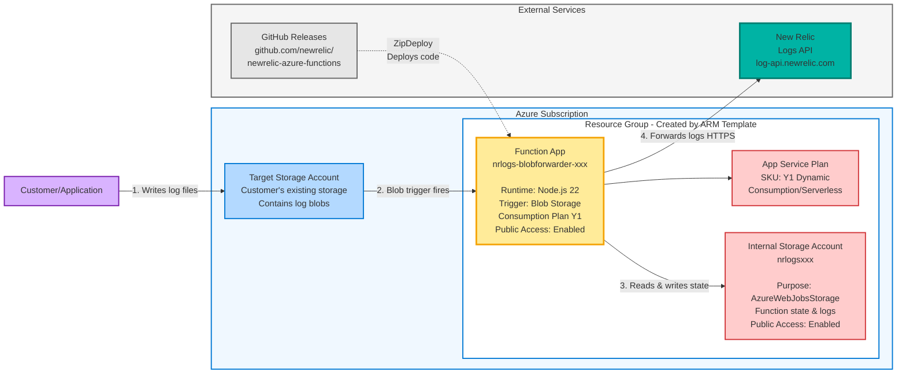
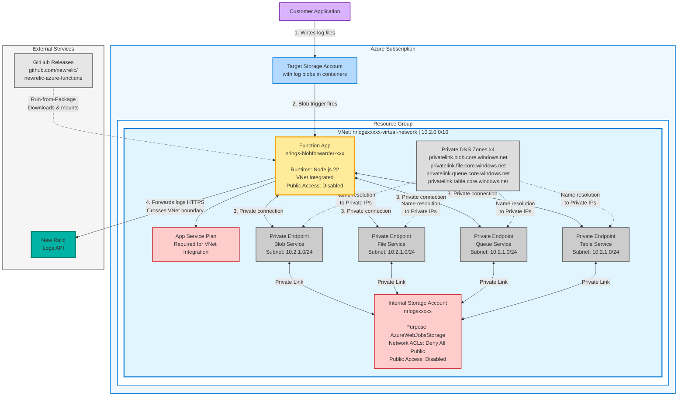
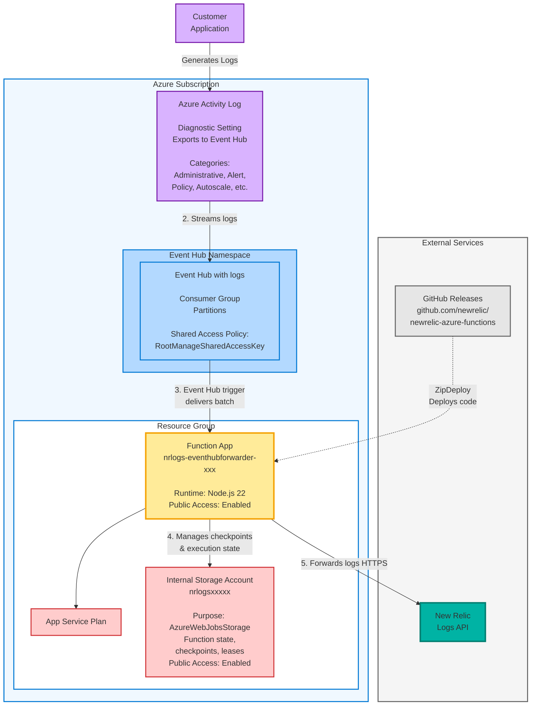
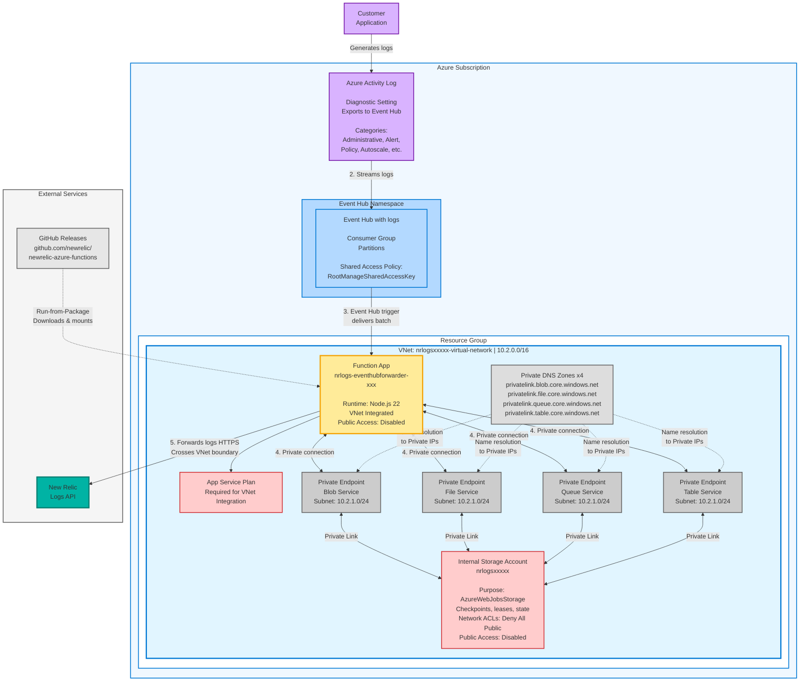

# Architecture Diagrams - Mermaid Code

Copy each diagram code into https://mermaid.live/ and export as PNG.

---

## 1. BlobForwarder - Standard Deployment

**Save as:** `screenshots/BlobForwarder/blob-standard-architecture.png`



---

## 2. BlobForwarder - Private VNet Deployment

**Save as:** `screenshots/BlobForwarder/blob-private-network-architecture.png`



---

## 3. EventHubForwarder - Standard Deployment

**Save as:** `screenshots/EventHub/eventhub-standard-architecture.png`



---

## 4. EventHubForwarder - Private VNet Deployment

**Save as:** `screenshots/EventHub/eventhub-private-network-architecture.png`



---

## Instructions

### Step 1: Generate Each Diagram
1. Go to https://mermaid.live/
2. Copy one of the mermaid code blocks above (between ```mermaid tags)
3. Paste into the editor
4. The diagram will render automatically

### Step 2: Export as PNG
1. Click **"Actions"** button (top right)
2. Select **"PNG"**
3. Save with the filename specified above

### Step 3: Move to Screenshots Folder
```bash
# After downloading all 4 diagrams, move them:
mv ~/Downloads/blob-standard-architecture.png screenshots/BlobForwarder/
mv ~/Downloads/blob-private-network-architecture.png screenshots/BlobForwarder/
mv ~/Downloads/eventhub-standard-architecture.png screenshots/EventHub/
mv ~/Downloads/eventhub-private-network-architecture.png screenshots/EventHub/
```

---

## Alternative: Use Draw.io for Better Layout Control

If Mermaid Live has overlapping text/boxes, I recommend using **Draw.io** (https://app.diagrams.net/) instead:

### Why Draw.io is Better for Complex Diagrams:
- ✅ Full control over component positioning
- ✅ No text overlap - you manually place everything
- ✅ Built-in Azure icon library
- ✅ Professional output
- ✅ Easy to adjust spacing

### Quick Steps:
1. Open https://app.diagrams.net/
2. File → New → Blank Diagram
3. Search for "Azure" in left panel to get icons
4. Manually recreate each diagram using the descriptions in this file
5. Export as PNG (File → Export as → PNG)

---

## Mermaid Limitations

If you're seeing overlapping boxes in Mermaid Live, this is a known limitation with:
- **Deep nesting** (3+ levels of subgraphs)
- **Complex layouts** with many connections
- **Long text labels** inside nested boxes

**Solutions:**
1. **Use Draw.io** (recommended for production diagrams)
2. **Export from Mermaid and edit in image editor** (quick fix)
3. **Simplify the diagrams** (remove some detail)

---

## Color Legend

- **Purple** - Customer/User/Azure Resources
- **Light Blue** - Azure Storage/Event Hub services
- **Yellow** - Function App
- **Pink/Red** - Internal Storage Account
- **Gray** - Private Endpoints & DNS
- **Teal** - New Relic (destination)
- **Light Blue Box** - Virtual Network boundary

---

## Key Differences Shown

### Standard vs Private VNet:
- **Standard**: All components have public access, no VNet boundary
- **Private VNet**: Function App and Internal Storage inside VNet, accessed via Private Endpoints

### BlobForwarder vs EventHubForwarder:
- **BlobForwarder**: Triggered by blob uploads to Storage Account
- **EventHubForwarder**: Triggered by events from Event Hub (fed by Activity Logs)