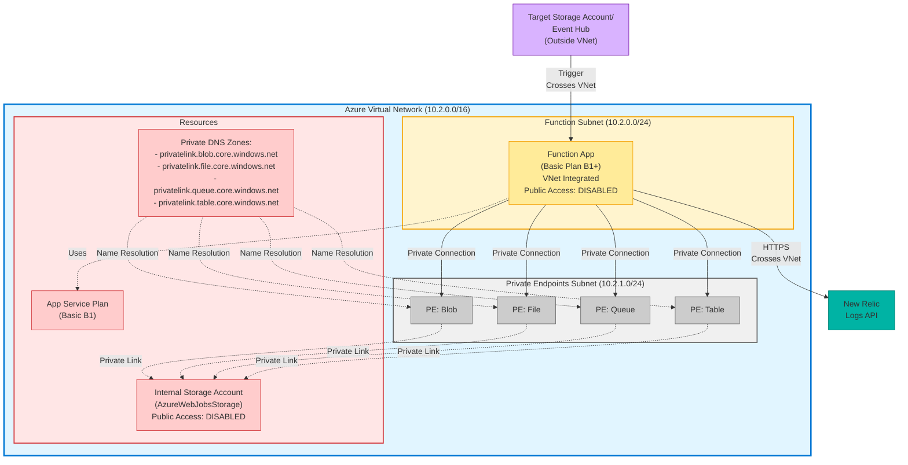

# Private VNet Deployment Architecture Diagram

## Mermaid Diagram Code

Copy this code into https://mermaid.live/ to generate the diagram, then export as PNG.



## Instructions:

### Step 1: Generate the Diagram
1. Go to https://mermaid.live/
2. Clear the default code
3. Paste the mermaid code above
4. The diagram will render automatically

### Step 2: Export as PNG
1. Click the **"Actions"** menu (top right)
2. Select **"PNG"** to download
3. Save as:
   - BlobForwarder: `blob-private-network-architecture.png`
   - EventHubForwarder: `eventhub-private-network-architecture.png`

### Step 3: Add to Repository
```bash
# For BlobForwarder
mv ~/Downloads/diagram.png screenshots/BlobForwarder/blob-private-network-architecture.png

# For EventHubForwarder (same diagram, just different name)
cp screenshots/BlobForwarder/blob-private-network-architecture.png screenshots/EventHub/eventhub-private-network-architecture.png
```

---

## Alternative: Draw.io Specification

If Mermaid doesn't give you the look you want, use Draw.io:

### Draw.io Steps:
1. Go to https://app.diagrams.net/
2. File → New Diagram
3. Choose "Blank Diagram"

### Components to Add:

**From Left Sidebar → Azure (search for Azure icons):**

1. **Create VNet Rectangle:**
   - Use "Rectangle" shape
   - Fill color: Light blue (#e1f5ff)
   - Border: Blue (#0078d4), 3px thick
   - Label: "Azure Virtual Network (10.2.0.0/16)"
   - Size: Large enough to contain everything below

2. **Inside VNet - Function Subnet:**
   - Rectangle
   - Fill: Light yellow (#fff4ce)
   - Label: "Function Subnet (10.2.0.0/24)"
   - Add **Azure Function** icon inside
   - Text below: "Function App (Basic Plan B1+, VNet Integrated, Public Access: DISABLED)"

3. **Inside VNet - Private Endpoints Subnet:**
   - Rectangle
   - Fill: Light gray (#f0f0f0)
   - Label: "Private Endpoints Subnet (10.2.1.0/24)"
   - Add 4 small gray boxes labeled:
     - PE: Blob
     - PE: File
     - PE: Queue
     - PE: Table

4. **Inside VNet - Bottom Section:**
   - **Storage Account** icon (pink box)
   - Text: "Internal Storage Account (AzureWebJobsStorage, Public Access: DISABLED)"

   - **DNS Zone** icon or badge
   - Text: "4 Private DNS Zones: privatelink.blob/file/queue/table.core.windows.net"

   - **App Service Plan** icon
   - Text: "App Service Plan (Basic B1)"

5. **Outside VNet - Left:**
   - **Storage Account** or **Event Hub** icon
   - Text: "Target Storage Account / Event Hub"
   - Dashed arrow to Function App
   - Label: "Trigger (crosses VNet)"

6. **Outside VNet - Right:**
   - Circle or cloud shape (teal color)
   - Text: "New Relic Logs API"
   - Solid arrow from Function App
   - Label: "HTTPS (crosses VNet)"

### Connections:
- Dashed lines from Function App to each Private Endpoint
- Dashed lines from Private Endpoints to Storage Account (label: "Private Link")
- Dashed lines from DNS Zones to Private Endpoints (label: "Name Resolution")

### Export:
- File → Export as → PNG
- Resolution: 300 DPI
- Transparent background: No

---

## Quick Text-Based Diagram (ASCII)

If you just need something quick for internal review:

```
╔═══════════════════════════════════════════════════════════════╗
║         Azure Virtual Network (10.2.0.0/16)                   ║
║                                                               ║
║  ┌─────────────────────────────────────────────────┐         ║
║  │ Function Subnet (10.2.0.0/24)                   │         ║
║  │                                                  │         ║
║  │   ┌────────────────────────────┐                │         ║
║  │   │    Function App            │                │         ║
║  │   │   (Basic Plan B1+)         │                │         ║
║  │   │   VNet Integrated          │                │         ║
║  │   │   Public Access: DISABLED  │                │         ║
║  │   └──────────┬─────────────────┘                │         ║
║  └──────────────┼──────────────────────────────────┘         ║
║                 │                                             ║
║  ┌──────────────▼────────────────────────────────┐           ║
║  │ Private Endpoints Subnet (10.2.1.0/24)        │           ║
║  │                                                │           ║
║  │  ┌──────┐  ┌──────┐  ┌──────┐  ┌──────┐     │           ║
║  │  │ PE:  │  │ PE:  │  │ PE:  │  │ PE:  │     │           ║
║  │  │ Blob │  │ File │  │Queue │  │Table │     │           ║
║  │  └───┬──┘  └───┬──┘  └───┬──┘  └───┬──┘     │           ║
║  └──────┼─────────┼─────────┼─────────┼─────────┘           ║
║         │         │         │         │                     ║
║         └─────────┴─────────┴─────────┘                     ║
║                   │                                          ║
║         ┌─────────▼──────────────────┐                      ║
║         │ Internal Storage Account   │                      ║
║         │ (AzureWebJobsStorage)      │                      ║
║         │ Public Access: DISABLED    │                      ║
║         └────────────────────────────┘                      ║
║                                                              ║
║  ┌──────────────────────────────────────────┐               ║
║  │ Private DNS Zones:                       │               ║
║  │ • privatelink.blob.core.windows.net      │               ║
║  │ • privatelink.file.core.windows.net      │               ║
║  │ • privatelink.queue.core.windows.net     │               ║
║  │ • privatelink.table.core.windows.net     │               ║
║  └──────────────────────────────────────────┘               ║
║                                                              ║
║  ┌────────────────────┐                                     ║
║  │ App Service Plan   │                                     ║
║  │ (Basic B1)         │                                     ║
║  └────────────────────┘                                     ║
╚═══════════════════════════════════════════════════════════════╝
         ▲                                    │
         │                                    │
         │ Trigger                            │ HTTPS
         │ (crosses VNet)                     │ (crosses VNet)
         │                                    ▼
┌────────┴─────────┐                ┌─────────────────┐
│ Target Storage   │                │   New Relic     │
│ Account /        │                │   Logs API      │
│ Event Hub        │                └─────────────────┘
└──────────────────┘
```

---

## My Recommendation

**Use Mermaid Live** (Option 1) because:
- ✅ Fastest - renders instantly
- ✅ Free - no account needed
- ✅ Easy to iterate - just edit the code
- ✅ Can export high-quality PNG
- ✅ I've already written the code for you

Just copy the mermaid code, paste it into https://mermaid.live/, and export as PNG!

Would you like me to adjust anything in the diagram specification?